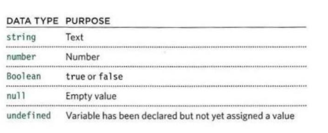
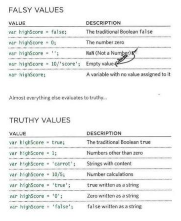
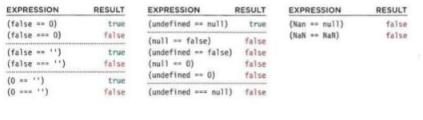

# If ... Else Statements

        If (time =      '1:00') {
        sleep();
        }
        else {
        coffee();
        }

- This first statement will only run if the the conditional statement is true. Otherwise the `else` statement will run. However, it will run if it is `true` that something in not equal to something else `!==`. 

## Switch Statement 

        var content;
        var level; 

        switch (classes) {
        case 101:
        content = 'Intro to HTML/CSS.'
        level = 'Beginner';
        break;
        case 102
        content = 'Intro to JavaScript.'; 
        level = 'Intermediate.';
        break;
        }

        var delta = document.getElementById.level.('data');

        delta.textcontent = msg; 

## Type coercion

> source: John Duckett's <u>JavaScript and Jquery</u>, pg. 166. 

Example: when JavaScript of one data type, such as a <b>string</b> is interpreted as an <b>int</b>.

## Weak Typing

Java Script has <b>weak typing</b>, which means that the type of data does not have to been defined in the code itself. In other programming languages live Java, they do. 

JavaScript:
        
        document.textcontent = ('Hello World!');

Java is a strongly types language. The string has to be defined as on `(String[])`:

    public static void main(String[] args) {
		System.out.println("Hello World!");
	}

## Truthy, Falsey

Every data type in JS can be treated as true or false. 

> source: John Duckett's <u>JavaScript and Jquery</u>, pg. 167.

## Checking Equality

`===` and `!==` result in less unforeseen values due to possible truthy or falsy values being evaluated by JS to the wrong data type. 

These would be potential examples:

> source: John Duckett's <u>JavaScript and Jquery</u>, pg. 168.

Example: A prompt without input validation is left blank: the string 'null' is returned (null means an empty value).

# Loops
A logical parameter is evaluated. If it is `true` a block of code executes. If not, we move on to the next line of code after the block. 

A variable, usually `i` is declared inside the parameter: `(i=0; i < 5; i++)`; This will be evaluated six times because that's how many times it will be true after incrementing 0 up to 5 run by run. This is known as `initialization`, `condition`, and `update`.  

keywords: `break` (to on to the next block of code)  and `continue` (continue with the current iteration) appear outside of the `parameter` (parentheses).

There are three types of loops, which each have different keywords:

## `for` loops
Usually used to loop through the items of an array. 

    
    var Numbers = [1, 2, 3, 4, 5, 6, 7, 8, 9, 10]

    var howMany = Numbers.length

    for (i=0; i < Numbers.length) {
        if (i = 7)
    }
        alert('seven!');
## `while` loops
Used to check if a condition is true if you don't know how many times you want that check made.

        num1 = prompt('Enter a number', '');

        num2 = prompt('Enter a number', '');

        myArray = [num1, num2]

        while (i = 0; i < 3; i++;) {

        if (myArray[i] === 7) {
        
        alert('you won!')
        }
        }

    Functions/methods saved as variables can be objects in an array:

        myArray[0] = Date.now;
        myArray[1] = myFunction;
        myArray[2] = myCars;

## `do while` loops

Statements in the code block come before condition. That means they are always run at least once. 